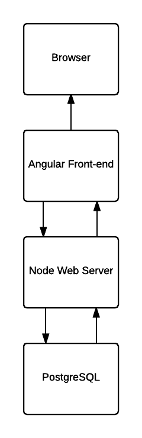
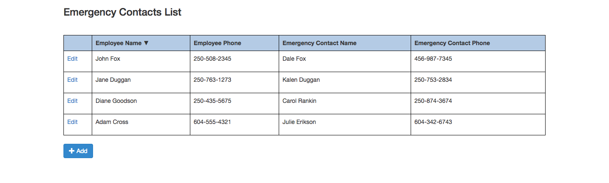
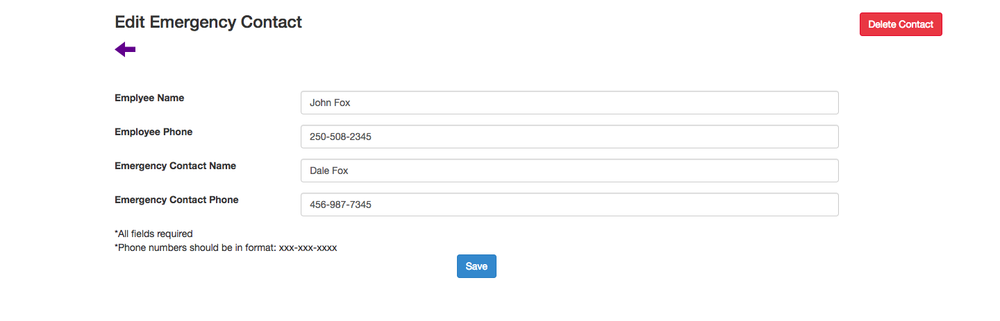
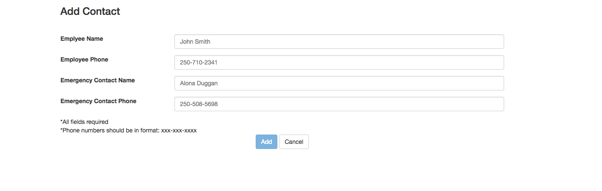

# Emergency Contact List

### Deployment
---
This app is deployed on heroku at:
https://emergency-contact-list.herokuapp.com/
### Architecture
---
emergency-contact-list is a simple app built using node.js and angular.js with a postgresql database. The architecture is as follows:

### Setup
---
You must have the following installed:
 - node version 5.8.0+
 - npm version 3.7.3+

To run locally:
 - Download the code or clone the repository
 - Navigate into the app directory
 - Run 'sudo npm install' to install all of the dependencies
 - Run 'node server.js' to start the server
 - Open a web browser and navigate to http://localhost:3000

### Screenshots
Emergency contact list (home) screen:

Edit emergency contact screen:

Add contact screen:

